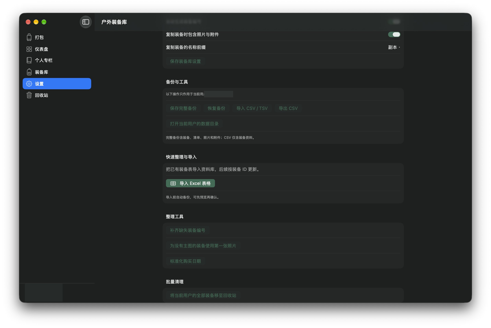

# 徒步装备库

一款 macOS 原生徒步装备管理应用。把装备、打包清单和徒步记录放在本机整理；路线、天气和汇率等联网功能按需使用。

[项目介绍页](https://llxace.github.io/outdoor-gear-library/) · [功能预览](Docs/index.html) · [问题反馈](https://github.com/llxace/outdoor-gear-library/issues)

> 发布仓库不包含任何用户装备清单、历史行程、照片、附件或备份。`Resources/InitialInventory.json` 是空白初始化模板；`Resources/DomesticRoutes.json` 是单独标注 ODbL 的公开路线数据。



截图直接取自本机正在运行的应用。为保护个人资料，发布前遮挡了用户名和头像；没有发布真实装备清单、购买金额、照片、附件或徒步行程。

## 功能

- **仪表盘：**查看在库装备、购置支出，以及按分类、重量或金额统计的分布和收藏装备速览。
- **装备档案：**维护品牌、型号、分类与子分类、数量、重量、状态、购买信息、位置、标签、备注、照片、附件和父子装备关系；支持搜索、收藏、复制、批量编辑与回收站。
- **行前打包：**从装备库选择物品、调整数量，汇总已知装备重量和价值；可筛选分类、只看已选项、加入其他用户的借用装备，清空后可撤销。
- **路线与天气：**内置路线目录，支持 GPX / KML 导入、按地点或名称搜索、地图预览和多段路线组合；查看路线距离、海拔来源、出发时段天气、最长 16 天逐日预报及远期趋势。
- **路餐与饮水：**按天数、人数和餐次安排食物，记录数量、重量、热量、价格和准备方式；汇总每日能量、目标、预算、备用粮和出发携水，生成采购清单，并可在本机识别包装营养标签。
- **徒步历史：**从打包清单生成记录或手动创建，保存日期、路线、轨迹、天气、感受、游记和当次装备快照；可按年份浏览与搜索。
- **装备照片：**保存主图、附加照片和文件；可选工具整理方形产品照，并可选择白底和阴影处理。
- **多个本机用户：**每个用户独立保存装备、照片、清单和设置；允许在打包清单中借用其他用户的装备。
- **资料迁移与备份：**Excel 导入支持字段映射和预览；CSV / TSV 导入、CSV 导出；完整备份包含装备、清单、照片与附件。
- **个性化与快速整理：**设置主题、资料库名称、显示货币、自动编号与复制附件选项；可补齐编号和主图、规范购买日期，刷新参考汇率。
- 装备资料、照片、附件和徒步记录默认保存在本机；路线搜索、天气与汇率等联网功能需要网络。

## 系统要求

- macOS 13 或更新版本
- Xcode 15 或更新版本

## 从源码构建

1. 克隆仓库并在 Xcode 中打开 `户外装备库.xcodeproj`。
2. 选择 `OutdoorGear` scheme 和 `My Mac` 运行目标。
3. 点击 Run，或在终端运行：

   ```sh
   xcodebuild -project "户外装备库.xcodeproj" -scheme OutdoorGear -configuration Release build
   ```

本项目没有 Swift Package Manager 第三方依赖。照片整理脚本是可选工具，需要 Python、NumPy 和 Pillow；白底抠图还需要 `rembg` 与本地 U²-Net 模型。主应用不依赖该脚本运行。

## 数据与隐私

本机装备资料保存在 `~/Library/Application Support/OutdoorGearNative/`。请勿把真实资料、个人照片、导出备份或数据库提交到公开仓库。仓库的 `.gitignore` 已排除常见本机资料与构建目录；上传前仍应检查 `git status` 和待提交内容。

## 来源与许可

- 应用源码：GNU AGPL-3.0，完整文本见 [`LICENSE`](LICENSE)。项目记录的上游参考为 [Homebox v0.26.2](https://github.com/sysadminsmedia/homebox/tree/v0.26.2)，详见 [`NOTICE.md`](NOTICE.md)。
- 路线数据：`Resources/DomesticRoutes.json` 按其元数据标注为 OpenStreetMap contributors / Waymarked Trails，数据库许可证 ODbL-1.0。详见 [`NOTICE.md`](NOTICE.md)。
- 外部服务及其数据分别受服务方条款约束；请在部署、再分发或商业使用前核对相应条款。

## License

Application source code is licensed under the GNU Affero General Public License v3. The bundled trail database is separately licensed under ODbL-1.0. See [`NOTICE.md`](NOTICE.md) for attribution and source details.
